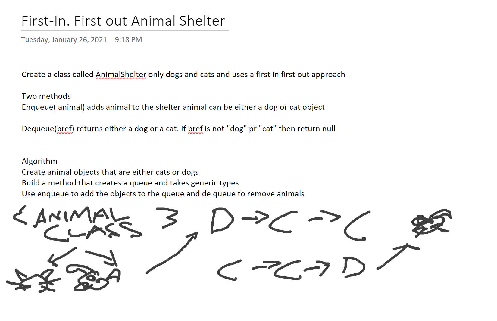

## Class 06 Challenge Summary
Code Challenge: Class 06 Linked list insertions
Author: Mike Falk

## Challenge Description
Write the following methods for the Linked List class:

.append(value) which adds a new node with the given value to the end of the list

.insertBefore(value, newVal) which add a new node with the given newValue immediately before the first value node

.insertAfter(value, newVal) which add a new node with the given newValue immediately after the first value node

## Approach & Efficiency

## Solution

## Class 07 Challenge Summary
Code Challenge: Class 07 Linked List Kth from the end
Author: Mike Falk
Date: 1/19/21

## Challenge Description
Write a method for the Linked List class which takes a number, k, as a parameter. Return the node’s value that is k from the end of the linked list. You have access to the Node class and all the properties on the Linked List class as well as the methods created in previous challenges.

## Approach & Efficiency

## Solution

## Class 08 Challenge Summary
Code Challenge: Class 08 ZipLists 
Author: Mike Falk
Date: 1/20/21

## Challenge Description
Write a function called zipLists which takes two linked lists as arguments. Zip the two linked lists together into one so that the nodes alternate between the two lists and return a reference to the head of the zipped list. Try and keep additional space down to O(1). You have access to the Node class and all the properties on the Linked List class as well as the methods created in previous challenges.

## Approach & Efficiency

## Solution

## Class 10 Challenge Summary
Code Challenge: Class 10 DataStructures Stacks and Queues 
Author: Mike Falk
Date: 1/22/21

## Challenge Description
reate a Node class that has properties for the value stored in the Node, and a pointer to the next node.
Create a Stack class that has a top property. It creates an empty Stack when instantiated.
This object should be aware of a default empty value assigned to top when the stack is created.
Define a method called push which takes any value as an argument and adds a new node with that value to the top of the stack with an O(1) Time performance.
Define a method called pop that does not take any argument, removes the node from the top of the stack, and returns the node’s value.
Should raise exception when called on empty stack
Define a method called peek that does not take an argument and returns the value of the node located on top of the stack, without removing it from the stack.
Should raise exception when called on empty stack
Define a method called isEmpty that takes no argument, and returns a boolean indicating whether or not the stack is empty.
Create a Queue class that has a front property. It creates an empty Queue when instantiated.
This object should be aware of a default empty value assigned to front when the queue is created.
Define a method called enqueue which takes any value as an argument and adds a new node with that value to the back of the queue with an O(1) Time performance.
Define a method called dequeue that does not take any argument, removes the node from the front of the queue, and returns the node’s value.
Should raise exception when called on empty queue
Define a method called peek that does not take an argument and returns the value of the node located in the front of the queue, without removing it from the queue.
Should raise exception when called on empty queue
Define a method called isEmpty that takes no argument, and returns a boolean indicating whether or not the queue is empty.
Be sure to follow your languages best practices for naming conventions.
You have access to the Node class and all the properties on the Linked List class.

## Approach & Efficiency

## Solution

## Class 11 Challenge Summary
Code Challenge: Class 11 PseudoQueue 
Author: Mike Falk
Date: 1/25/21

## Challenge Description
Create a brand new PseudoQueue class. Do not use an existing Queue. Instead, this PseudoQueue class will implement our standard queue interface (the two methods listed below), but will internally only utilize 2 Stack objects. Ensure that you create your class with the following methods:

enqueue(value) which inserts value into the PseudoQueue, using a first-in, first-out approach.
dequeue() which extracts a value from the PseudoQueue, using a first-in, first-out approach.
The Stack instances have only push, pop, and peek methods. You should use your own Stack implementation. Instantiate these Stack objects in your PseudoQueue constructor.
## Approach & Efficiency

## Solution

## Class 12 Challenge Summary
Code Challenge: Class 12 AnimalShelter 
Author: Mike Falk
Date: 1/26/21

## Challenge Description
Create a class called AnimalShelter which holds only dogs and cats. The shelter operates using a first-in, first-out approach.
Implement the following methods:
enqueue(animal): adds animal to the shelter. animal can be either a dog or a cat object.
dequeue(pref): returns either a dog or a cat. If pref is not "dog" or "cat" then return null.
## Approach & Efficiency

## Solution

## Class 13 Challenge Summary
Code Challenge: Class 13 MultiBracketValidation 
Author: Mike Falk
Date: 1/27/21

## Challenge Description
Your function should take a string as its only argument, and should return a boolean representing whether or not the brackets in the string are balanced. There are 3 types of brackets:

Round Brackets : ()
Square Brackets : []
Curly Brackets : {}

## Approach & Efficiency

## Solution

